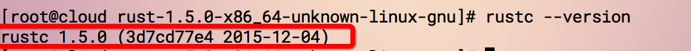

#Rust for Linux

Rust supports mainstream operating systems，Linux,Mac and windows.

Rust two installation methods for Linux users：

### 1、Download the installation package directly：

To download the installation package directly, you need to check whether your current operating system is 64-bit or 32-bit, and download the corresponding installation package.

To view the operating system, execute the following command in the terminal:
**Only on Linux and MacOS**
`uname -a`

The result is shown below：

As shown above, if it is **x86_64** 64-bit system，to [download](https://static.rust-lang.org/dist/rust-1.5.0-x86_64-unknown-linux-gnu.tar.gz) 64-bit installation package；

If operating system is **x86-32** to [download](https://static.rust-lang.org/dist/rust-1.5.0-i686-unknown-linux-gnu.tar.gz) 32-bit installation package;

After downloading the installation package, unzip and run. *At the time of this writing, the latest stable version is 1.5.0,*
 Unzip：`tar -zxvf rust-1.5.0-x86_64-unknown-linux-gnu.tar.gz`
 
After decompression, enter the corresponding directory：`cd rust-1.5.0-x86_64-unknown-linux-gnu`
 执行: `./install.sh`
 
After the above command is executed, it will print： **Rust is ready to roll.** This indicates successful installation.

Execute at this time: `rustc --version`, You will see the corresponding rust version information, as shown below：

### 2、One-click installation from the command line：
Rust provide simple one-click installation, the command is as follows：

`curl -sSf https://static.rust-lang.org/rustup.sh | sh`

Open the terminal and execute the above command.

**Notice**

In addition to the stable version，rust also provided Beta with Nightly version，download address is as follows：
https://www.rust-lang.org/downloads.html

If you don't want to install rust on your computer，but you still want try rust，Then here is an online environment：http://play.rust-lang.org/
