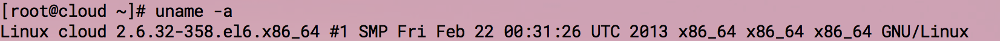
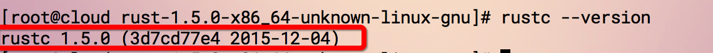

# Rust for Linux

Rust 支持主流的操作系统，Linux,Mac和 windows。

Rust 为Linux用户提供了两种安装方式：

### 1、直接下载安装包：

直接下载安装包的话需要检查一下你当前操作系统是64位还是32位，分别下载对应的安装包。

查看操作系统请在终端执行如下命令:

`uname -a`

结果如下图所示：

如上图所示，如果是 **x86_64** 则证明是64位系统，需要[下载](https://static.rust-lang.org/dist/rust-1.5.0-x86_64-unknown-linux-gnu.tar.gz)64位安装包；

如果是**x86-32**则需要[下载](https://static.rust-lang.org/dist/rust-1.5.0-i686-unknown-linux-gnu.tar.gz)32位安装包

下载安装包后解压运行即可。*在书写本章时，最新的稳定版本为1.5.0，*
 解压：`tar -zxvf rust-1.5.0-x86_64-unknown-linux-gnu.tar.gz`

 解压完进入对应的目录：`cd rust-1.5.0-x86_64-unknown-linux-gnu`
 执行 `./install.sh`

上述命令执行完成后会打印： **Rust is ready to roll.** 表明安装成功

此时执行: `rustc --version`, 你会看到对应的 rust 版本信息,如下图所示：

### 2、命令行一键安装：
Rust 提供简单的一键安装，命令如下：

`curl -sSf https://static.rust-lang.org/rustup.sh | sh`

打开终端执行如上命令即可。

**注意**

除了稳定版之外，Rust 还提供了 Beta 和 Nightly 版本，下载地址如下：
https://www.rust-lang.org/zh-CN/other-installers.html

如果你不想安装 Rust 在你的电脑上，但是你还是像尝试一下 rust，那么这里有一个在线的环境：http://play.rust-lang.org/

中国科学技术大学镜像源包含 [rust-static](http://mirrors.ustc.edu.cn/rust-static/)，梯子暂时出问题的同学可以尝试从这里下载编译器；除此之外。还有 Crates 源，详见[这里的说明](https://servers.ustclug.org/2016/01/mirrors-add-rust-crates/)。
